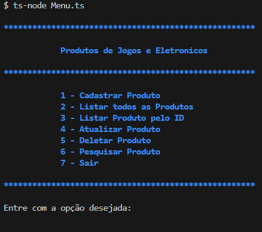
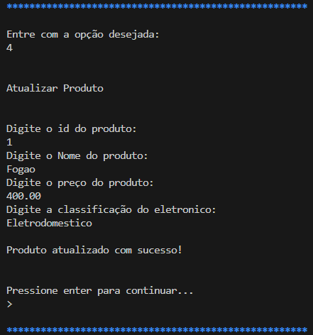
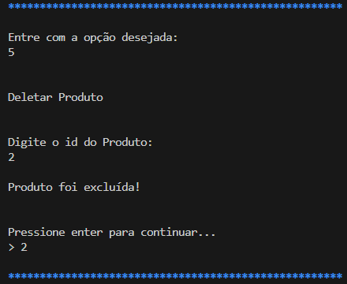
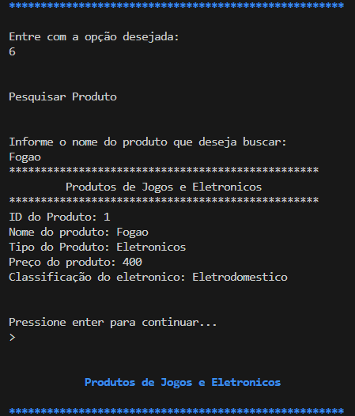
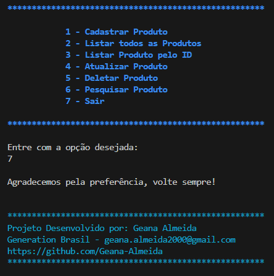

<h1 align="center">Sistema de E-COMMERCE</h1>

<div align="center">
  <strong>🐳 ⚙️ 🌐</strong>
</div>
<div align="center">
  Um projeto de E-Commerce utilizando Typescript, node.js e a biblioteca readlinesync.
</div>

## 💻 Instalação
* Node.js
* Faça o clone do projeto
* Execute o comando ```npm install```


## 🚀 Rodar o projeto

* ```ts-node Menu.ts``` - Executa a aplicação com ts-node no terminal

## 🔨 Funcionalidades do projeto
<div align="center">
  Este projeto visa desenvolver um sistema de e-commerce especializado na venda de produtos eletrônicos e jogos. O sistema possui as seguintes funcionalidades principais:
</div>
* **Cadastro de Produtos:** Permite a adição de novos produtos ao sistema com detalhes completos.
* **Listagem de Produtos:** Exibe todos os produtos cadastrados no sistema.
* **Consulta de Produto por ID:** Permite a visualização dos detalhes de um produto específico usando seu identificador único.
* **Atualização de Produtos:** Facilita a modificação das informações de produtos existentes.
* **Exclusão de Produtos:** Permite a remoção de produtos do sistema.
* **Pesquisa de Produtos:** Oferece a funcionalidade de buscar produtos com base em critérios específicos.

## 🎥  Projeto em ação

*  <strong>📄 Menu:</strong>



*  <strong>Cadastro de Produtos:</strong>
  


*  <strong>Listagem de Produtos:</strong>

 


*  <srong>Consulta de Produto por ID:</srong>


*  <srong>Atualizar Produto:</srong>



*  <srong>Deletar Produto:</srong>



*  <srong>Pesquisar Produto:</srong>




*  <srong>Saindo</srong>




## Contribuição 🤝

Este é um projeto de código aberto e adoraríamos receber contribuições da comunidade de desenvolvedores! Sinta-se à vontade para fazer fork deste repositório, trabalhar em melhorias e enviar pull requests para análise.

Se você encontrar problemas ou tiver sugestões, abra uma issue e teremos prazer em discuti-las.

Lembre-se de seguir as diretrizes de contribuição do projeto e respeitar o código de conduta.

Junte-se a nós para tornar este projeto ainda mais incrível!

---

Aproveite os templates e divirta-se criando READMEs incríveis! 😄✨

