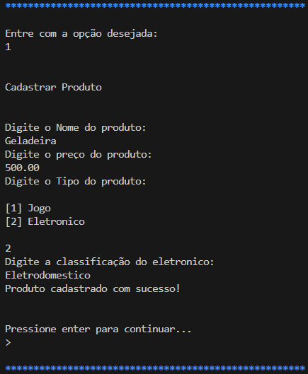
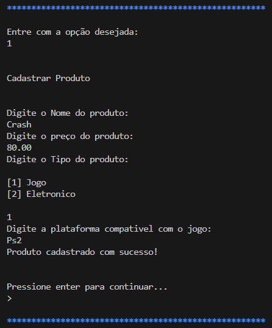
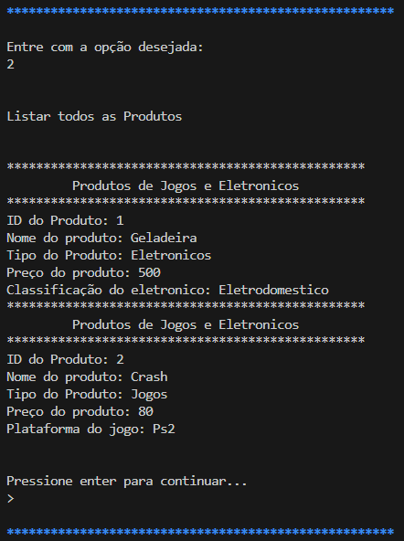
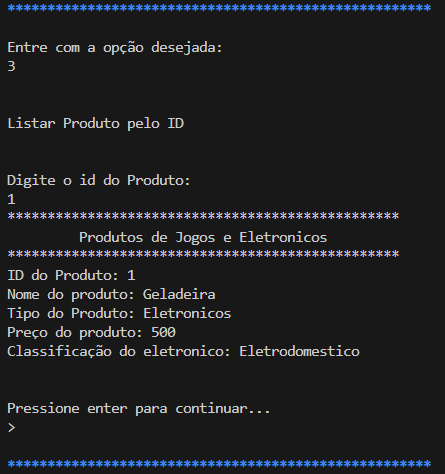

<h1 align="center">Sistema de E-COMMERCE</h1>

<div align="center">
  <strong>🐳 ⚙️ 🌐</strong>
</div>
<div align="center">
  Um projeto de E-Commerce utilizando Typescript, node.js e a biblioteca readlinesync.
</div>

## 💻 Instalação
* Node.js
* Faça o clone do projeto
* Execute o comando ```npm install```


## 🚀 Rodar o projeto

* ```ts-node Menu.ts``` - Executa a aplicação com ts-node no terminal

## 🔨 Funcionalidades do projeto
<div align="center">
  Este projeto visa desenvolver um sistema de e-commerce especializado na venda de produtos eletrônicos e jogos. O sistema possui as seguintes funcionalidades principais:
</div>
* **Cadastro de Produtos:** Permite a adição de novos produtos ao sistema com detalhes completos.
* **Listagem de Produtos:** Exibe todos os produtos cadastrados no sistema.
* **Consulta de Produto por ID:** Permite a visualização dos detalhes de um produto específico usando seu identificador único.
* **Atualização de Produtos:** Facilita a modificação das informações de produtos existentes.
* **Exclusão de Produtos:** Permite a remoção de produtos do sistema.
* **Pesquisa de Produtos:** Oferece a funcionalidade de buscar produtos com base em critérios específicos.

## 🎥  Projeto em ação
<div align="center">
  **Cadastro de Produtos:**
</div>



<div align="center">
  **Listagem de Produtos:**
</div>



<div align="center">
  **Consulta de Produto por ID:**
</div>



